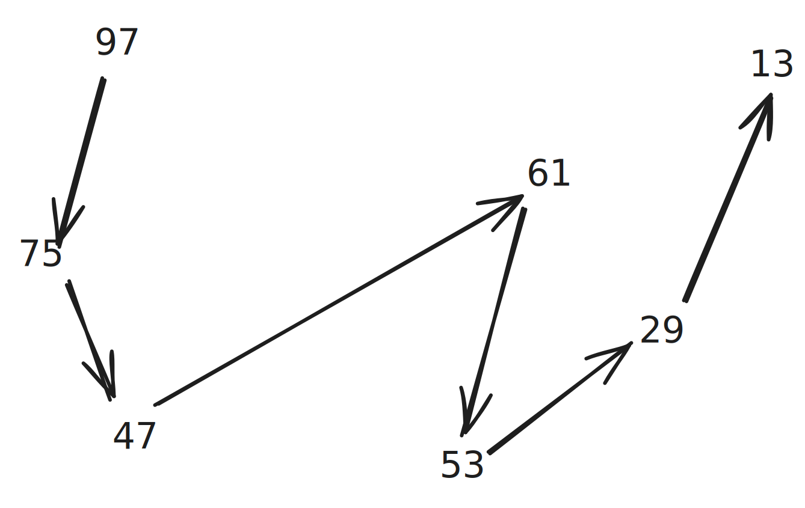

# Day 5

# Part 1

What a joy! First day where a bit of Computer Science might actually help.
So to me this looks like a [DAG](https://en.wikipedia.org/wiki/Directed_acyclic_graph), since if there has to be an order, cycles cannot be allowed. Otherwise the problem could not be solved.

For not I just hope that it's one cohesive DAG, and not 2 or more. Technically there is a possibility that more than one, disjoined DAGs are defined by the rules. If this occurs, we'll see.

We can see that there in this case there is one "start" and one "end". In this case `97` is the start and `13` the end. Again, there might be more than one "start" or "end".

My idea is to precompile an order so that `97=0` and `13=7` so that we then just map the numbers to their ascending number and check if the array is already sorted. Why? My assumption is that you do the work upfront and then it's efficient to check for each input.

The start and ends are easy, what about the _middle_ nodes? We can do a so called transitive reduction, simplifying the graph. Basically, if we know that `97` needs to be before `61` and `13` and at the same time `61` needs to be before `13`, we can delete the `97` before `13` link, as it's already specified going over `61`. Basically we eliminate all the "shortcuts". This gives us a nice line in this case.

_no code has been written until now, this might go terribly wrong 💩_
